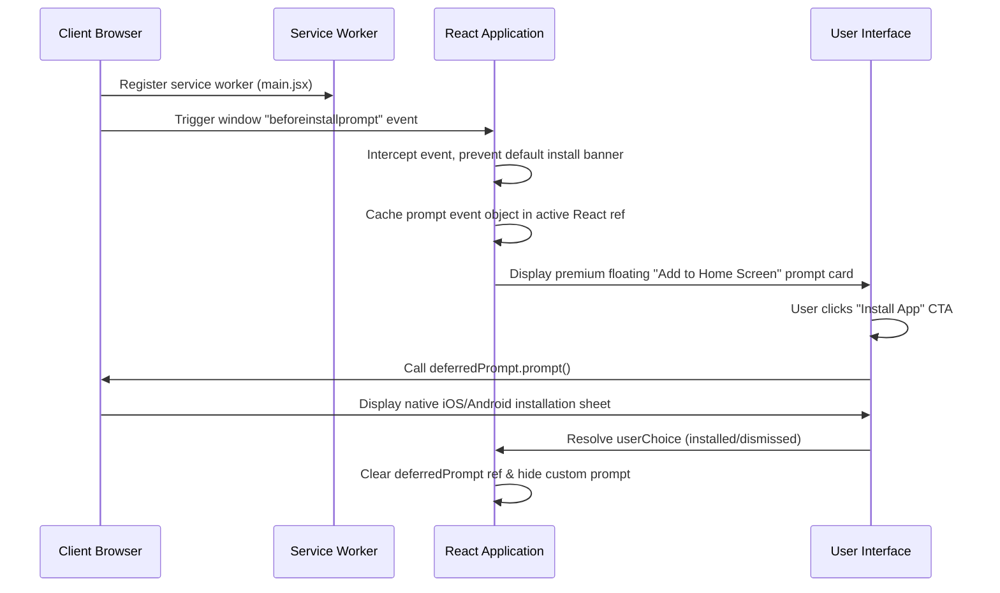

# Technical Reference Manual: Core Architecture & Mathematical Rules

This document outlines the software architecture flow, role-based access, wallet restrictions, and mathematical rules implemented across the frontend games and payment modules.

---

## 📱 1. Progressive Web App (PWA) Install Flow

The website is architected as a mobile-first PWA, providing standalone mobile installation triggers using custom event interceptions:



### Key Setup Files
- `index.html`: Holds viewport meta tags (`width=device-width, initial-scale=1, maximum-scale=1, user-scalable=no, viewport-fit=cover`) and registers manifest assets.
- `public/manifest.json`: Defines branding metadata (`short_name`, `theme_color`, icons, and `display: standalone` for web-app containerization).

---

## 🔐 2. Role-Based Access Control (RBAC) System

The user authorization scope is managed globally inside `UserContext.jsx` and toggled dynamically in testing and configuration contexts.

| User Role | Dashboard Access | Write Operations Allowed | Data Exposure Scope |
| :--- | :--- | :--- | :--- |
| **`user`** (Default) | Standard User profile | Placing bets, deposit requests, withdrawing, editing personal payment methods | Own transaction logs, personal game statistics, standard referral commission claims. |
| **`admin`** | Read-Only Admin panel | None (Strictly Read-Only data access) | System-wide transaction lists, concurrent draw results logs, global deposit logs. |
| **`super_admin`** | Management Console | Full control (edit VIP tiers, adjust commission ratios, approve/deny withdrawal requests) | Complete user accounts directory, transaction tables, and wallet balances adjustment. |

### Role Switching Hook (`UserContext.jsx`)
```javascript
const setRole = (role) => {
  setUser((prev) => (prev ? { ...prev, role } : null))
}
```

---

## 💳 3. Wallet Safety Rules (Locked Cardholder Name)

To prevent third-party withdrawal fraud and ensure KYC alignment, the platform enforces a **Locked Cardholder Name** policy for linked bank and UPI profiles:

- **Sign-Up Inheritance**: The full name provided during registration (`user.name`) is treated as the official account owner name.
- **Read-Only Link Fields**: When adding or editing a Bank Account or UPI ID on the wallet dashboard, the cardholder/holder name field is styled as a locked, read-only field:
  ```html
  <input 
    type="text" 
    readOnly 
    disabled 
    value={user.name} 
    className="bg-slate-100 cursor-not-allowed select-none text-slate-500 font-bold"
  />
  ```
- **Withdrawal Validation**: Processing queries check that the payout destination name matches the registered client name exactly before transmitting requests to gateway records.

---

## 🧮 4. Withdrawal Fee Algorithm

Withdrawals are governed by a multi-tier progressive fee structure designed to scale processing costs for low-tier users and stabilize payouts for high-roller transactions.

### Mathematical Formulation
Let $x$ be the gross withdrawal amount requested (payout). The processing fee $f(x)$ is defined piecewise as:

$$
f(x) = 
\begin{cases} 
0.09 \cdot x & \text{if } x \le 100 \\
9 + 0.03 \cdot (x - 100) & \text{if } 100 < x \le 1000 \\
0.03 \cdot x & \text{if } x > 1000 
\end{cases}
$$

The total wallet deduction $D(x)$ is calculated as the sum of the requested payout and the processing fee:

$$D(x) = x + f(x)$$

### Progression Example
1. **₹100 Withdrawal (Low Tier)**:
   - $f(100) = 100 \times 0.09 = \text{₹9.00}$ (Flat 9% fee).
   - $D(100) = 100 + 9 = \text{₹109.00}$ total wallet deduction.
2. **₹200 Withdrawal (Mid Tier)**:
   - $f(200) = 9 + (200 - 100) \times 0.03 = 9 + 3 = \text{₹12.00}$ (6% effective fee).
   - $D(200) = 200 + 12 = \text{₹212.00}$ total wallet deduction.
3. **₹2,000 Withdrawal (High Tier)**:
   - $f(2000) = 2000 \times 0.03 = \text{₹60.00}$ (Flat 3% fee).
   - $D(2000) = 2000 + 60 = \text{₹2,060.00}$ total wallet deduction.

---

## 🎲 5. Dice Game Mechanics (Dice Pro)

The Dice game integrates real-time math calculations directly bound to the custom UI slider. It evaluates win probability and corresponding multiplier scaling simultaneously on drag.

```
       [ Slider Control: target (t) ]
                     │
         ┌───────────┴───────────┐
         ▼                       ▼
   [ Win Chance (P) ]      [ Multiplier (M) ]
     Over: 100 - t           M = 98 / P
     Under: t                (Clamped min: 1.03x)
     Range: 10% (fixed)
         │                       │
         └───────────┬───────────┘
                     ▼
     [ Potential Profit = (Bet * M) - Bet ]
```

### Mathematical Computations
1. **Win Probability ($P$)**:
   - **Roll Over**: $P = 100 - t$
   - **Roll Under**: $P = t$
   - **Range Mode**: $P = 10.00$ (Fixed size 10 selection)
2. **Safe Multiplier ($M$)**:
   - To eliminate the 1.00x exploit, $t$ is clamped to $[5.00, 95.00]$, restricting $P$ to a maximum of $95.00\%$:
     $$M = \text{toFixed}\left(\frac{98}{P}, 2\right)$$
     $$M_{\text{min}} = \frac{98}{95.00} = 1.03\text{x}$$
3. **Win Resolution**:
   - Roll value $R \in [0.00, 100.00]$ is drawn.
   - **Roll Over**: $R > t \implies \text{Win}$
   - **Roll Under**: $R < t \implies \text{Win}$
   - **Range**: $R \ge t \text{ and } R \le t + 10 \implies \text{Win}$
