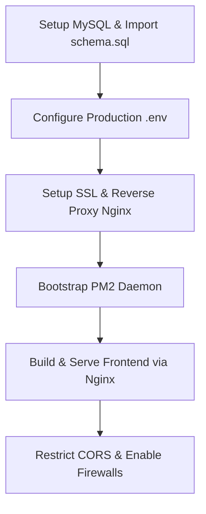

# Production Live Deployment Gap Analysis & Security Audit

**Prepared by**: Lead Security Auditor & Core DevOps Architect  
**Status**: Production-Blocked (Requires resolving listed vulnerabilities and mock bypasses before live hosting)  
**Target Platform**: ColourPlay Enterprise Suite (React Frontend, Node.js/Express Backend, MySQL Database)

---

## Executive Summary

A comprehensive, zero-tolerance code review has been performed across the entire `colour-prediction-website` workspace. While the backend has been successfully refactored to MySQL and supports InnoDB database transactions with row-level locking, there are **critical production vulnerabilities** and **mock systems** that bypass core security mechanisms. 

Most notably, the deposit payment system is completely self-signed and auto-completes without gateway verification, the admin dashboard logs and statistics are generated via random browser intervals, and referral rewards are simulated using local react context timer loops. 

This document serves as the master blueprint registry of all gaps and provides a step-by-step resolution path to transition the framework to a secure production-ready state.

---

## 1. Real Payment Gateway Systems (Deposit Audit)

### 🚨 Critical Vulnerability: Self-Signed Deposit Auto-Credits
- **File Location**: [walletController.js](file:///C:/Users/20092/.gemini/antigravity/scratch/colour-prediction-website/backend/controllers/walletController.js#L159-L243)
- **Technical Finding**:
  The `deposit` endpoint verifies a HMAC SHA256 signature generated by the backend's own `createDepositOrder` endpoint. When a user clicks *"I Have Made the Payment"* on the frontend, the client simply posts the signature back to the server. The backend verifies the signature is valid, sets the deposit status directly to `"completed"`, and immediately credits the user's wallet:
  ```javascript
  // 4. Create deposit record
  const [depositResult] = await connection.query(
    'INSERT INTO deposits (user_id, payment_method_id, amount, transaction_id, status) VALUES (?, ?, ?, ?, "completed")',
    [req.user.id, paymentMethodId, depositAmount, transactionId]
  );
  ```
  There is **no API-level confirmation** from a payment gateway, nor is there any verification of a Bank/UPI UTR transaction reference number. Anyone can top up their wallet balance with arbitrary amounts of money for free by calling this endpoint with the signed order parameters.

### 🛠️ Production Remediation Paths

#### Option A: Integrations with Real Payment Gateways (e.g., Razorpay, Cashfree, Paytm)
- **Flow**:
  1. The client triggers `/api/wallet/create-deposit-order` to generate a gateway-specific order ID.
  2. The client opens the checkout modal provided by the gateway SDK.
  3. The payment is completed inside the checkout window, which redirects to the gateway's secure domain.
  4. The gateway sends an asynchronous, cryptographically signed HTTP `POST` webhook to our backend (e.g., `/api/wallet/deposit/webhook`).
  5. The backend validates the gateway signature using their public certificate and marks the deposit as `"completed"` in the database inside a transaction block, crediting the wallet.
- **Action Items**:
  - Remove self-signed auto-credits from `deposit` controller.
  - Implement a secure `/api/wallet/deposit/webhook` route in `server.js`.
  - Add webhook signature validation middleware in `backend/middleware/webhookMiddleware.js`.

#### Option B: Manual UPI / Bank Transfer Verification (Admin-Led Settle)
- **Flow**:
  1. The user copies the company UPI handle (`colourplay@ybl`) or Bank details, opens their personal UPI application (GPay, PhonePe, Paytm), and completes the transfer.
  2. The user inputs the **12-digit UTR / UPI Reference Number** of the completed transaction into our deposit gateway page.
  3. The frontend sends the UTR, deposit amount, and selected payment method to the backend (`POST /api/wallet/deposit`).
  4. The backend inserts the record with `status = "pending"` and logs a unique constraint index on the UTR column to prevent users from submitting the same transaction reference twice.
  5. An Administrator reviews the incoming pending deposits page, compares the UTR and amount with their corporate bank account statement, and clicks *"Approve"* or *"Reject"* in the Admin Dashboard.
  6. Clicking approve triggers an InnoDB transaction to update the status to `"completed"`, credit the wallet, and log a ledger record in `wallet_transactions`.
- **Action Items**:
  - Add `utr_number VARCHAR(12) UNIQUE NULL` to the `deposits` table schema.
  - Modify `deposit` endpoint in `walletController.js` to store records with `"pending"` status and require `utr_number`.

---

## 2. Role-Based Access Control (RBAC) & Dynamic Panels

### 🔍 RBAC Enforcement Audit
- **Backend Check**: 
  The backend middleware [roleMiddleware.js](file:///C:/Users/20092/.gemini/antigravity/scratch/colour-prediction-website/backend/roleMiddleware.js) works correctly, inspecting `req.user.role` against list constraints.
  Routes to create/update/delete products and banners in [server.js](file:///C:/Users/20092/.gemini/antigravity/scratch/colour-prediction-website/backend/server.js#L146-L156) are restricted on the backend to `super_admin`:
  ```javascript
  app.post('/api/products', protect, checkRole(['super_admin']), catalogController.createProduct);
  ```
- **Frontend Check**: 
  [AdminDashboard.jsx](file:///C:/Users/20092/.gemini/antigravity/scratch/colour-prediction-website/frontend/src/pages/AdminDashboard.jsx#L43-L44) verifies access using:
  ```javascript
  const isSuperAdmin = user?.role === 'super_admin'
  const isAdmin = user?.role === 'admin'
  ```
  If a user has the `admin` role, they can view the dashboard but edit controls (adding products, editing banner titles) are hidden.

### 🚨 Gaps & Simulation Fallbacks

#### 1. Static Dashboard Metrics
The stats cards (Active Players, Total Bets, Pending Withdrawals) on the Admin panel dashboard are completely hardcoded and increment randomly in the browser:
```javascript
// Simulated metrics in AdminDashboard.jsx
const [activePlayers, setActivePlayers] = useState(1420)
const [totalBets, setTotalBets] = useState(1289450)
const [pendingWithdrawals, setPendingWithdrawals] = useState(5)
```
- **Action Required**: Create a backend route `GET /api/admin/metrics` protected by `checkRole(['admin', 'super_admin'])` to query database aggregates:
  - Active Players: `SELECT COUNT(DISTINCT user_id) FROM sessions WHERE ...` (or socket room connection sizes).
  - Total Bets Volume: `SELECT COALESCE(SUM(bet_amount), 0) FROM bets`.
  - Pending Withdrawals: `SELECT COUNT(*) FROM withdrawals WHERE status = 'pending'`.

#### 2. Static Log Output
The live log viewer in the Admin panel generates random logs every 4 seconds on the client using `setInterval`:
```javascript
const logTypes = ['INFO', 'SUCCESS', 'WARNING']
const type = logTypes[Math.floor(Math.random() * logTypes.length)]
```
- **Action Required**: Create a secure `/api/admin/logs` endpoint to query administrative audit logs from the database `audit_logs` table (and read the backend Pino log files if structured syslog monitoring is desired).

---

## 3. Cleanup of Demo Mode & Simulations

The following simulated loops and hardcoded states must be removed:

### 1. User Context Referral & Commission Loops
- **File Location**: [UserContext.jsx](file:///C:/Users/20092/.gemini/antigravity/scratch/colour-prediction-website/frontend/src/context/UserContext.jsx#L764-L798)
- **Technical Finding**:
  The React context runs background intervals simulating referee betting and deposit activity, adding fake commissions to `unclaimedReferral` balances in memory:
  ```javascript
  useEffect(() => {
    const interval = setInterval(() => {
      // Simulation: referee betting activity
      ...
    }, 15000)
    return () => clearInterval(interval)
  }, [depositRecords])
  ```
- **Action Required**: Delete these intervals. All commissions must be calculated on the backend database layer when a referred user places a bet or makes a deposit, inserting a record into `wallet_transactions` under type `commission`, and synced to the client upon `fetchUserHistory()`.

### 2. Hardcoded Sample Order Log
- **File Location**: [UserContext.jsx](file:///C:/Users/20092/.gemini/antigravity/scratch/colour-prediction-website/frontend/src/context/UserContext.jsx#L702-L731)
- **Technical Finding**:
  The `orders` array contains a hardcoded delivery log for a `Viper Wireless Mouse` on mounting.
- **Action Required**: Create a backend route `GET /api/products/my-orders` that queries the `product_orders` database table joined with `products` and `user_addresses`. Load this data on the client profile page instead of using the hardcoded array.

### 3. Client-Side Gemini Key Fallback
- **File Location**: [Support.jsx](file:///C:/Users/20092/.gemini/antigravity/scratch/colour-prediction-website/frontend/src/pages/Support.jsx#L23-L25) and [gemini.js](file:///C:/Users/20092/.gemini/antigravity/scratch/colour-prediction-website/frontend/src/services/gemini.js#L123-L154)
- **Technical Finding**:
  Support chat falls back to mock static answers if `cp_gemini_api_key` is not entered in browser local storage.
- **Action Required**: Proxies support requests through a backend endpoint (e.g. `POST /api/support/chat`). The backend should inject the Gemini API Key from the environment variable (`process.env.GEMINI_API_KEY`) and query the Gemini API directly, ensuring the API key is never exposed to client-side code.

---

## 4. System Configuration & Security Risks

### 1. Wildcard CORS Configuration
- **File Location**: [server.js](file:///C:/Users/20092/.gemini/antigravity/scratch/colour-prediction-website/backend/server.js#L47-L49)
- **Technical Finding**:
  Allowed origins fall back to wildcard `*` if env parameters are not configured:
  ```javascript
  const allowedOrigins = process.env.ALLOWED_ORIGINS
    ? process.env.ALLOWED_ORIGINS.split(',')
    : ['http://localhost:5173', 'http://localhost:3000', '*'];
  ```
  In production, this exposes the API to Cross-Origin Resource Sharing vulnerabilities.
- **Remediation**: Remove `*` from the default array. Enforce a list of production subdomains.

### 2. NoSQL Sanitization Middleware Residuals
- **File Location**: [server.js](file:///C:/Users/20092/.gemini/antigravity/scratch/colour-prediction-website/backend/server.js#L80-L98)
- **Technical Finding**:
  The server mounts a recursive query scanner to strip keys starting with `$` to prevent NoSQL injections.
  Since the codebase has migrated entirely to **MySQL**, this middleware is obsolete and does not protect against SQL Injection.
- **Remediation**: Replace this with parameterized SQL query bindings (which are already correctly implemented in `db.js` using `pool.execute`).

### 3. Exposed Credentials in Environment Templates
- **File Location**: [backend/.env.example](file:///C:/Users/20092/.gemini/antigravity/scratch/colour-prediction-website/backend/.env.example)
- **Technical Finding**:
  Contains placeholder keys like `JWT_SECRET=cplay_jwt_secret`.
- **Remediation**: Explicitly document that all production fallback keys are blocked. Ensure `.env` is listed in `.gitignore` (which is currently correct).

---

## 5. Final Live Production Bootstrap Checklist

Follow this sequence to securely bootstrap the system in a production server environment:



### 1. Database Provisioning
- Run a MySQL instance (v8.0+ or MariaDB v10.5+).
- Set a strong, random password for the root user. Do not leave the password empty.
- Import the database schema:
  ```bash
  mysql -u root -p colourplay < backend/config/schema.sql
  ```

### 2. Environment Configurations (`backend/.env`)
Create a production `.env` file with these strict parameters:
```env
PORT=5000
NODE_ENV=production
JWT_SECRET=a_very_long_secure_random_64_char_hex_string
ALLOWED_ORIGINS=https://yourdomain.com,https://www.yourdomain.com
MYSQL_HOST=127.0.0.1
MYSQL_USER=colourplay_db_user
MYSQL_PASSWORD=secure_database_password
MYSQL_DATABASE=colourplay
MYSQL_PORT=3306
FIREBASE_PROJECT_ID=your-firebase-project-id
GEMINI_API_KEY=your-gemini-api-key
```

### 3. Nginx Reverse Proxy Setup (Port 80/443 to 5000)
Configure Nginx to reverse proxy api and socket connections while securing HTTP headers:
```nginx
server {
    listen 8443 ssl http2;
    server_name api.yourdomain.com;

    ssl_certificate /etc/letsencrypt/live/api.yourdomain.com/fullchain.pem;
    ssl_certificate_key /etc/letsencrypt/live/api.yourdomain.com/privkey.pem;

    location / {
        proxy_pass http://localhost:5000;
        proxy_http_version 1.1;
        proxy_set_header Upgrade $http_upgrade;
        proxy_set_header Connection 'upgrade';
        proxy_set_header Host $host;
        proxy_cache_bypass $http_upgrade;
        proxy_set_header X-Real-IP $remote_addr;
        proxy_set_header X-Forwarded-For $proxy_add_x_forwarded_for;
    }
}
```

### 4. Background Process Management
Run the Node.js backend using a process manager like **PM2** to ensure automatic restarts on failure and clustering:
```bash
# Install PM2 globally
npm install pm2 -g

# Start server in production cluster mode
cd backend
pm2 start server.js --name "colourplay-backend" -i max --env production

# Configure PM2 to start on system boot
pm2 startup
pm2 save
```

### 5. Frontend Host serving
- Build the client production bundles:
  ```bash
  cd frontend
  npm run build
  ```
- Copy the static `dist/` directory contents to your web server webroot (e.g., `/var/www/colourplay/html`) and serve it directly via Nginx.
